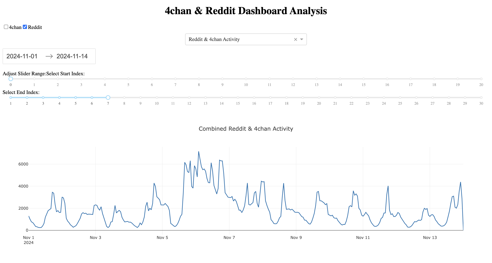
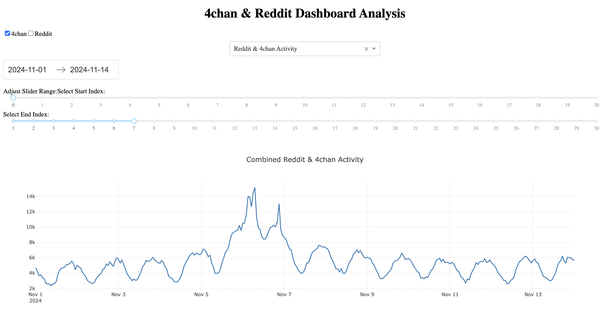
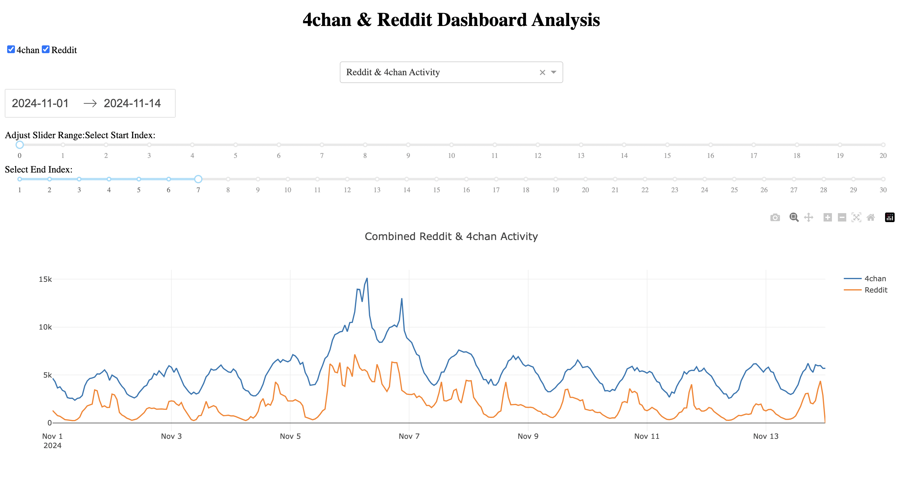
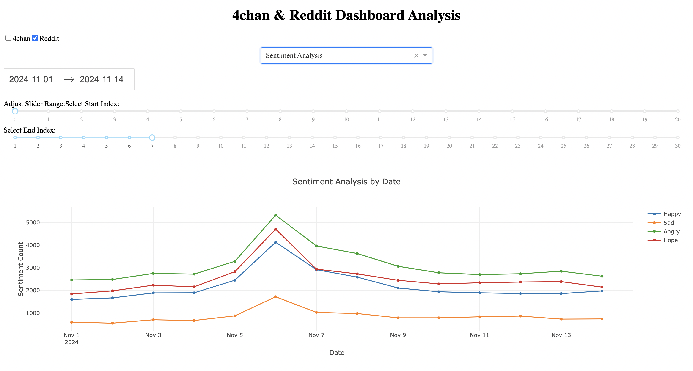
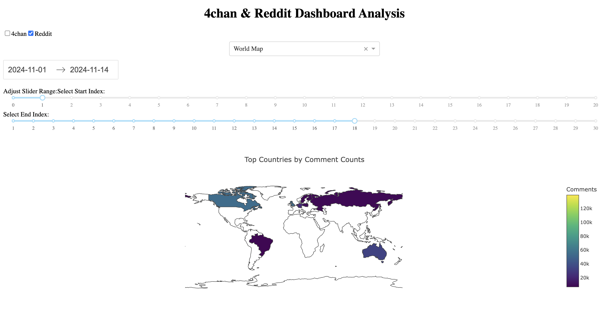

Direction to run code:

1. pip install all the required dependencies
2. Goto /SMDP_PRJ3/local_dashboard and run python3 app.py
3. Visit http://127.0.0.1:5001/dashboard/ on your machine to view the website

What does Code do?

The code sets up a **web dashboard** using **Flask** (web server) and **Dash** (interactive visualization) to analyze and visualize 4chan & Reddit activity and sentiment trends.

---

### 1. **Framework Initialization**
- **Flask**: Handles server-side operations.
- **Dash**: Enables dynamic visualization (charts, maps, and interactivity).

---

### 2. **Data Preprocessing**
Several preprocessing functions are defined:
1. **World Map Data**:
   - Process data to show comment counts by country.
2. **4chan Data**:
   - Analyzes 4chan hourly activity over time.
3. **Reddit Data**:
   - Analyzes Reddit hourly activity over time.
4. **Sentiment Analysis**:
   - Categorizes comments by emotion (happy, sad, angry, hopeful) using keyword detection.

---

### 3. **Merge & Preprocess for Visualization**
- Combines 4chan & Reddit hourly activity.
- Prepares sentiment summaries over time for visualization.

---

### 4. **Interactive Dashboard with Options**
The user can choose:
1. **Graph type**:
   - **Activity trends** for 4chan and Reddit.
   - **Sentiment Analysis** visualization.
   - **World Map** showing the number of comments by country.
2. **Data range selection** via date sliders or filters.

---

### 5. **Dynamic Chart Updates**
The callback function dynamically updates the visualization based on:
- User's choice of data source (4chan, Reddit).
- Selected graph type.
- Specified date range.

---

### 6. **Visualization Components**
Visualizations include:
1. **Line charts**: For Reddit & 4chan trends over time.
2. **Sentiment graphs**: Plots sentiment categories over time.
3. **Choropleth map**: Displays countries with the highest number of comments.

---

### 7. **Deployment**
- The server runs at `http://127.0.0.1:5001`, with an interactive web interface for visualization.

This integrates data from Reddit and 4chan, processes sentiment trends, and creates visual insights into activity patterns and global comment trends.

### 7. **Screenshots**
- Dataset timeseries graph

- Sentiment

- World Map

